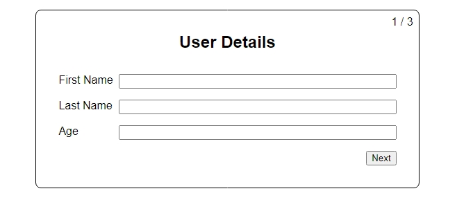

# Multi-Step Form

This is a [tutorial](https://www.youtube.com/watch?v=uDCBSnWkuH0&list=PL4EX4Aw5_AFv-9yS-9lF3SNHUImZyygK7&index=4&t=20s) project from [Web Dev Simplified](https://www.youtube.com/@WebDevSimplified) on YouTube. (shoutout to Kyle - he's awesome!)

## The challenge

Users should be able to:

- Navigate the form steps back and forth 
- See the step number / total steps in the upper right corner
- Find the previous data in input fields when they navigate after filling out some fields
- See the alert message after they click finish button in the last step

### Screenshot

## Links

- [View Code](https://github.com/elizerdim/multi-step-form)
- [Live Preview](https://multi-step-form-ecru-sigma.vercel.app/)

## Built with

- React
- TypeScript

## What I learned

This was a nice little project to practice React with TypeScript and solidify my knowledge of them. It was also good to see how a challenge like this can be tackled by using hooks and state.

- React custom hooks
- Partials in TypeScript
- Combining types with & operator in TypeScript

## Useful resources

- [Differences Between Type Aliases and Interfaces](https://www.typescriptlang.org/docs/handbook/2/everyday-types.html#differences-between-type-aliases-and-interfaces) - This link has an example for combining types with & operator, and how it is used compared to extended interfaces.